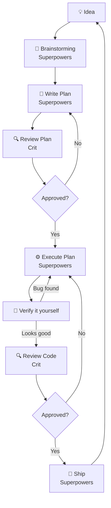

AI can generate code faster than you could ever imagine. And it mostly works!

Let's say you ask your favourite agent to build a feature. Five minutes later, you have 500 lines of code that compiles, passes tests and looks about right. Except you start digging into it and notice that the architecture is questionable, error handling is inconsistent, and you're not sure that the edge cases that agent swore it had taken into consideration are actually handled at all.

It's natural to jump to a conclusion that that's the best AI can do, but, just like it is with humans, workflow quite often turns out to be less than optimal. One-shot prompt-and-forget is tempting, but AI isn't a magic wand. And if you go straight from "prompt" to "code" with no structured review in between you tend to end up with a pumpkin rather than a chariot.

This tutorial walks through a different approach using an open source, local-first stack that brings structured planning, document review, and code review into your AI coding workflow.

We'll be using OpenCode in this tutorial, but you can easily swap it for your favourite agentic harness instead be it ClaudeCode, Cursor, Aider, Pi or anything else. The real magic comes from these two tools:

- **[Superpowers](https://github.com/obra/superpowers)** — An agentic skills framework (236K+ GitHub stars) that enforces a complete software development methodology: brainstorm, plan, TDD, review, ship.
- **[Crit](https://github.com/tomasz-tomczyk/crit)** — UI for reviewing AI-generated plans, code and even web apps and pages with inline comments. The **code and document review open source tool** with over 500 stars on GitHub that makes the feedback loop between agent and human much more pleasant for both.

By the end of this tutorial, you'll have a complete human-in-the-loop workflow that allows you to confidently develop and ship features with the assistance of AI.

---

## Step 1: Install the Stack

### Install OpenCode

To install OpenCode run:

```bash
curl -fsSL https://opencode.ai/install | bash
```

If you run into troubles — please refer to the documentation for [OpenCode](https://opencode.ai).

### Install Superpowers

Superpowers are available as a plugin for multiple platforms. There are multiple ways to configure OpenCode — for this tutorial we will use the project level configuration. Create an `opencode.json` file at the root with the following configuration:

```json
{
  "$schema": "https://opencode.ai/config.json",
  "plugin": ["superpowers@git+https://github.com/obra/superpowers.git"]
}
```

For other agents, e.g. Claude Code, you can install from the official marketplace:

```bash
/plugin install superpowers@claude-plugins-official
```

### Install Crit

Crit is distributed as a single binary.

**For Mac:**

```bash
brew install crit
```

**For Windows:**

```powershell
iwr https://github.com/tomasz-tomczyk/crit/releases/latest/download/crit-windows-amd64.exe -OutFile crit.exe
```

**For Linux:**

```bash
nix profile install github:tomasz-tomczyk/crit
```

If you have Go installed on your machine you can also install Crit with:

```bash
go install github.com/tomasz-tomczyk/crit/cmd/crit@latest
```

And then simply run:

```bash
crit install opencode
```

See [Crit integration](https://crit.md/integrations) for ways to use Crit with other agents.

You should see a message indicating that the plugin was installed successfully:

```
Installed: .opencode/commands/crit.md
  Installed: .opencode/skills/crit/SKILL.md
  Installed: .opencode/plugins/crit.ts
  Installed: opencode.jsonc
  Run /crit in OpenCode to start a review loop
  The crit skill is available to OpenCode agents when needed
  Crit's opencode plugin gates sharing instructions on share_url being set
```

You might be prompted to add a plugin manually if you already had an existing `opencode.json` configuration. In this case, do so, then restart OpenCode.

### Verify the Installation

```bash
# Check Crit is available
crit --help
```

```bash
# Check OpenCode can find Superpowers
opencode
# Then type: "List the skills you have available"
```

You should see both Superpowers skills listed: such as `brainstorming`, `writing-plans`, `test-driven-development`, `requesting-code-review`, `crit` and `crit-cli`:


---

## Step 2: Understand the Workflow

Before we dive into the commands, here's the big picture. The full loop looks like this:



Every feature goes through this loop. It's slower than "vibe coding" initially, but since you're reviewing every step of the way, you can catch AI slop before it pollutes your codebase.

---

## Step 3: Start a Session and Brainstorm

Start your coding agent and describe what you want to build.
Instead of jumping straight into code, the agent activates its **brainstorming** skill.

**Try this prompt:**

> "I want to build a REST API that would allow users to create short links"

Instead of writing code, the agent will ask clarifying questions to refine the requirements and present design options with trade-offs.

You'll see something like:


This is the first key difference from a _normal_ AI coding session. So put on your tech lead hat and start reviewing the **design** document.

---

## Step 4: Review the Plan with Crit

Once the brainstorming is done, the agent writes an implementation plan.

The plan gets saved to something like `docs/superpowers/specs/2026-06-26-shortlink-api-design.md`.

Now open it in Crit for review using slash command within the agent:

```bash
/crit docs/superpowers/specs/2026-06-26-shortlink-api-design.md
```

Or, you can simply run `/crit` without specifying a file to review the changes made during current session. Crit will automatically detect what you're reviewing documentation and will show markdown reviewer interface.

Crit opens a browser window with the plan loaded and waits for you to review it.

Walk through the plan line by line. Leave comments on anything that needs changing: point at the line and nitpick away.


When you're done, press `Finish review` to save your comments and exit. Crit stores your comments as JSON in `.crit/`:

```json
{
  "file": "docs/superpowers/specs/2026-06-26-shortlink-api-design.md",
  "comments": [
    {
      "line": 45,
      "body": "Auto-generated aliases need a collision check — a 6-char base62 code will clash at scale",
      "timestamp": "2026-06-26T10:30:00Z"
    }
  ]
}
```

If you started the review process from a terminal outside your agent - you can copy and paste the feedback and your coding agent will take it from there.

---

## Step 5: Agent Addresses Your Feedback

Once the agents gets the feedback, it revises the plan, responds to comments and presents the updated version. You can re-review with Crit to verify the changes.

You might go through 2-3 rounds of this. That's normal and is the whole point of this process. As tedious as it is to review the document - it's best to catch design issues **before** any code is written.

When you're satisfied with the plan, click "Approve" to move on to the next step.


---

## Step 6: Execute the Plan

Once the plan is approved, start a fresh conversation for implementation by typing `/new`.

> Note: You can also use this trick if agent gets stuck. OpenCode is a good open source tool, but sometimes it can get a little moody and need some extra help. If it won't work seamlessly for you, you can always switch to another harness. Superpowers are _just_ a collection of markdown skills and Crit works with pretty much any agent you can think of the same way.

Starting new conversation is deliberate as the planning session can get long, and a clean context window allows the agent to focus on execution and since the documented plan persists between the sessions, the agent can pick up where it left off.

If the agent nods off without creating a plan, tell it something like:

```
"The spec at docs/superpowers/specs/2026-06-26-shortlink-api-design.md is approved. Move to the next step."
```

After that you should have a document in the plans directory.
You can review it with Crit again:

```
/crit docs/superpowers/plans/2026-06-26-shortlink-api.md
```

> Tip: It's better to go through many rounds of smaller comments, especially if the plan is long and complex than reviewing the plan all at once. Agents tend to perform better when they can focus on one thing at a time.

Once you're ready with the plan, you'll see something like:

```
Review approved — all comments resolved, no changes needed. Plan is finalized at docs/superpowers/plans/2026-06-26-shortlink-api.md.
Two execution options:
1. Subagent-Driven (recommended) — I dispatch a fresh subagent per task, review between tasks, fast iteration.
2. Inline Execution — Execute tasks in this session using executing-plans, batch execution with checkpoints.
Which approach?
```

Unless you have a reason not to, you can safely go with the subagent-driven approach.

By default, this is where Superpowers' **executing-plans** skill takes over. The agent works through the plan task by task:

1. Creates a git worktree for isolated development
2. Runs baseline tests to confirm a clean starting point
3. Works through each task with TDD (RED → GREEN → REFACTOR)
4. Self-reviews the code.

We would like to intercept that and ask the agent to use crit skill so that we can review the code in between tasks instead of only self-review. A simple prompt like this one would do the trick:

```
Use the crit skill so that I can review the code in between tasks.
```

You don't need to watch over its shoulder. The agent knows what to build, what patterns to follow, and what trade-offs you agreed on. Go make coffee ☕. It'll wait for your review before proceeding to the next task.


---

## Step 7: Final review

Once the agent is done with all the tasks, it'll request your final review on the README file with the instructions on how to run the server:


When you're happy with the README file, the agent will do a final review on the whole branch, don't worry, you wouldn't have to review it all.

And when it's done - it's finally time kick the tyres. Run the freshly written shortlink server, following the instructions in the README file, e.g.:

```bash
export JWT_SECRET=changeme
go run ./cmd/server
```

Now try it out it end to end.

Sign up through the API:


Create a short link:


And watch it redirect in the browser or in the terminal, for posterity:


## Step 8: Next Cycle: UI

Hopefully your API is also verified and is in good shape. But there isn't much fun in just a bare API. Besides, it wouldn't be a real workflow if you could run it only once. So how about we do another cycle and see how easy it would be to maintain the project using the same open source tools and the same loop of planning, documenting and reviewing?

Open a fresh session (clean context, same as before) and ask:

> "Add a simple, but premium web UI to the link shortener. Complete with user signup, login, link management and analytics features."

You'll go through the same flow as before, but hopefully notice that it goes a little faster this time. Superpowers scales the same flow down to fit the size of the task: a short brainstorm, a small plan, a quick review of that plan in Crit — nothing you haven't already done up until the point where the UI is ready for you to test.

Something along the lines of:

```
# Todos
[•] Write design spec to docs/superpowers/specs/2026-06-26-web-ui-design.md
[ ] Self-review spec for placeholders/contradictions/ambiguity/scope
[ ] Commit spec to git
[ ] Ask user to review the written spec
```

Next, you'll repeat the same process of reviewing the plan and code for every implementation task as before.

## Step 9: Review the Running App with Crit Live Mode

Once the agent is done with the frontend it's time to look at it with a *Crit*ical eye. As fun as reading HTML and CSS is - being able to comment on the actual rendered app is a much more natural way to review it:

```bash
/crit live http://localhost:8080
```

Crit proxies your running dev server and overlays its review UI on the live page. Here is your chance to point to the agent anything that you don't like. Drop a comment right on an element and send the feedback using the same `Finish review` loop as the plan and code reviews.

It's also a good idea to implement tasks vertically, so that you're not exhausting yourself by reviewing document after document and diff after diff. And if you do get to a state where you are tempted to just approve everything without reading, it's better to take a break and come back later than to redo all the work.

To start reviewing the running app, run the following slash command in your agent:

```
/crit live http://localhost:8080
```


The agent reads you comments and makes changes, fires the review again and keeps iterating with you until you approve. And often it takes more than a few rounds to get there.

This view took 13 rounds to get to the approved state:


## That's the loop, folks!

In this tutorial we've implemented a full-stack application from scratch using only open source tools and went through two cycles of planning, documenting, and reviewing AI-generated output.

And because you have reviewed every decision the agent made and every bit of code it generated - you can keep iterating on the same codebase without losing your sanity.

Just like us humans, the AI agents love structure and work best in smaller scopes with a shorter feedback cycle. And the fact that you can do every step of the AI workflow - plan, document and review AI-generated code efficiently - with nothing but open source tools is definitely a cherry on top.